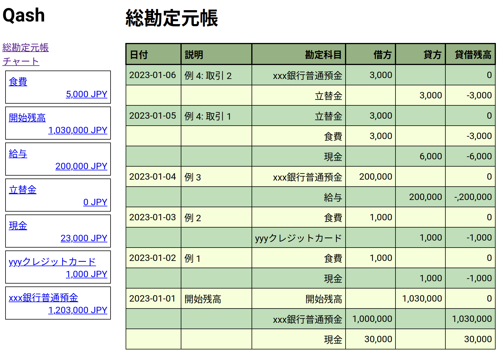
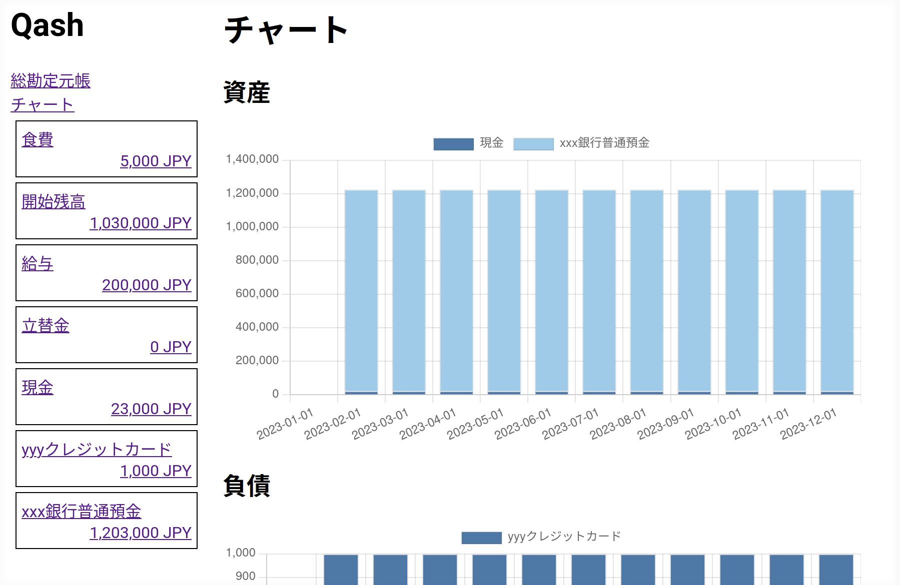
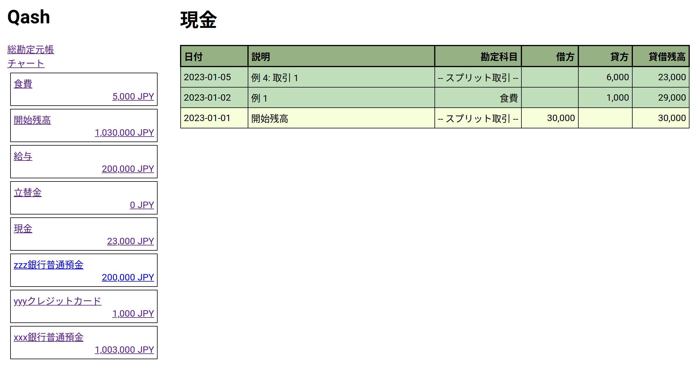

# Qash

A programming language for double-entry accounting, inspired by [Beancount](https://github.com/beancount/beancount).

## Example

```
!open-account asset     資産:流動資産:ほげ銀行普通預金 JPY #cash
!open-account asset     資産:流動資産:現金             JPY #cash
!open-account asset     資産:立替金                    JPY
!open-account equity    資本:開始残高                  JPY
!open-account expense   費用:食費                      JPY
!open-account income    収益:給与                      JPY
!open-account liability 負債:未払金                    JPY

(* コメント *)
* 2023-05-08 "コンビニ" #タグ1 #タグ2
  資産:流動資産:現金  -502
  費用:食費            502

!import "01_overlay.qash"
  * 2023-05-09 "コンビニ ふが"
    資産:流動資産:現金  -1502
    費用:食費            1300
    資産:立替金           202

// コメント
```

## Usage

```
NAME
       qash - A command-line accounting tool

SYNOPSIS
       qash COMMAND …

COMMANDS
       check [OPTION]… FILE


       dump [OPTION]… IN-FILE OUT-FILE


       generate [OPTION]… NUM-ENTRIES


       of-gnucash-csv [OPTION]… TRANSACTIONS-CSV-FILE


       of-json [OPTION]… FILE


       serve [OPTION]… IN-FILE


       to-json [OPTION]… FILE
```

## ハンズオン：Qash で始める家計簿

ここでは Qash を使って家計簿をつけるために必要な情報を記述します。
Qash は複式簿記と呼ばれる簿記法に基づいて設計されていますが、
以下では「複式簿記」という言葉は使用せず、Qash 特有の事項と複式簿記の一般的な事項を意図的に混ぜて記載します。

読者として、基本的な Linux コマンドの使い方やエディタの使い方を知っていることを想定しています。
複式簿記の知識は不要です。

Qash では全ての取引を**勘定科目**の間のお金の動きとして表現します。
ここで勘定科目とはお金を区別するためのラベルで、
例えば「現金」「xxx 銀行普通預金」「立替金」「開始残高」「yyy クレジットカード」「食費」「給与」などを指します。
勘定科目は **資産（asset）**・**負債（liability）**・**資本（equity）**・**費用（expense）**・**収益（income）** の 5 つに分かれます。
上の例でいうと「現金」・「xxx 銀行普通預金」・「立替金」は資産、「開始残高」は資本、「yyy クレジットカード」は負債、「食費」は費用、
「給与」は収益になります。
資本（純資産とも呼ばれます）は聞き馴染みが無いかもしれませんが、
この文章では、資本は開始残高の別名だと思っても差し支えありません。
以下では主に資本以外（資産・負債・費用・収益）について取り扱います。

さて勘定科目には残高が紐付いています。例えば勘定科目「現金」の残高が 10,000 円であることは、
（単に）いまの現金が 10,000 円であることを表しています。同様に勘定科目「xxx 銀行普通預金」の残高が 1,000,000 円であるなら、
xxx 銀行の普通預金に 1,000,000 円入っているはずです。負債も同様で、勘定科目「yyy クレジットカード」の残高が
10,000 円であることは、次回以降のクレジットカードの引き落とし合計額が 10,000 円であることを表しています。
費用・収益にも残高はありますが、これらの勘定科目についてはむしろ、期間を区切った合計のほうが重要です。
つまり、家計簿をつけている全期間の食費の合計（これが残高）よりも、
2023 年 8 月の食費のほうが意味があります。Qash では後述する「チャート」でこれが表示されます。

先程も述べたように、Qash で記録する全ての取引勘定科目間のお金の動きとして表現されます。
すべての取引は、次の原則に従います：

- 資産・費用の増加は正（`+`）の値で記述します。逆に、資産・費用の減少は負（`-`）の値で記述します。
- 負債・資本・収益の増加は負（`-`）の値で記述します。逆に、負債・資本・収益の増加は正（`+`）の値で記述します。
- 一つの取引に含まれる全ての値の合計は必ず `0` になります。

Qash は、これらの原則を満たさない（特に一番最後の原則を満たさない）取引を見つけるとエラーを出力します。

Qash でつけられる取引の例を（日本語で）示します。上の原則を満たしつつ、最終的な残高が期待通りになっていることを確認してみてください。

- 例 1: 現金で食費 1000 円を支払った場合、勘定科目「現金」は `-1000`、勘定科目「食費」は `+1000`
- 例 2: yyy クレジットカードで食費 1000 円を支払った場合、勘定科目「yyy クレジットカード」は `-1000`、勘定科目「食費」は `+1000`
- 例 3: 給与 200,000 円が xxx 銀行普通預金に振り込まれた場合、勘定科目「給与」は `-200,000`、勘定科目「xxx 銀行普通預金」は `+200,000`
- 例 4: 飲食店で友人の分（3,000 円）も合わせて計 6,000 円を現金で支払い、後日 xxx 銀行普通預金に立替分を返してもらった場合、以下 2 つの取引を記録します：
  - 取引 1: 勘定科目「現金」は `-6000`、勘定科目「食費」は `+3000`、勘定科目「立替金」は `+3000`
  - 取引 2: 勘定科目「立替金」は `-3000`、勘定科目「xxx 銀行普通預金」は `+3000`
- 例 5: xxx 銀行普通預金から zzz 銀行普通預金に 200,000 円振り替えた場合、勘定科目「xxx 銀行普通預金」は `-200,000`、勘定科目「zzz 銀行普通預金」は `+200,000`

それでは実際に取引を Qash を使って書いてみます。
Qash は上のような取引を記述するための簡単なプログラミング言語になっていて、
好きなテキストエディタや Git などのバージョン管理ツールを使って家計簿を管理できます。

まず Qash を入手します。Qash は OCaml で書かれているので、
まず OCaml をインストールする必要があります。

```console
# OCaml の package manager である OPAM を導入し OCaml をインストール
$ bash -c "sh <(curl -fsSL https://raw.githubusercontent.com/ocaml/opam/master/shell/install.sh)"
$ opam init # OPAM の初期化と OCaml のインストール
$ eval $(opam env --switch=default)

# Qash のソースコードをダウンロードし、ビルド
$ git clone https://github.com/ushitora-anqou/qash.git
$ cd qash
$ opam install . --deps-only
$ dune build bin/main.exe
$ _build/default/bin/main.exe --version
0.1.0
```

続いて、好きなテキストエディタを起動して以下のように入力し、
好きなファイル名（ここでは `root.qash`）で保存してください。

```
// ← これで始まる行はコメントです。
(* ← 複数行に渡るコメントはこれで始めて、
   これで終わります → *)
(* ネストも (* でき (* ま *) す *) *)

(*
  まず勘定科目を定義します。!open-account 命令を使います。
  キャッシュフロー計算で現金として扱うものは #cash をつけます。
*)
!open-account asset 現金 JPY #cash
!open-account asset xxx銀行普通預金 JPY #cash
!open-account asset zzz銀行普通預金 JPY #cash
!open-account asset 立替金 JPY
!open-account equity 開始残高 JPY
!open-account liability yyyクレジットカード JPY
!open-account expense 食費 JPY
!open-account income 給与 JPY

(*
  続いて取引を記述します。文法は以下のようになっています。

  * YYYY-MM-DD "説明" #タグ
     勘定科目 金額
     ...

  ただし：
  - #タグ は任意です。以下の例では使っていません。
  - 金額は一箇所に限って省略できます。省略した場合、
    合計が 0 になるように自動的に補完されます。
*)

// まず開始残高を設定します。日付は適当で構いません。
* 2023-01-01 "開始残高"
  現金                  30,000 // カンマの有無は不問
  xxx銀行普通預金    1,000,000
  開始残高

// 例 1: 現金で食費 1000 円を支払った場合、
//       勘定科目「現金」は `-1000`、勘定科目「食費」は `+1000`
* 2023-01-02 "例 1"
  現金                  -1,000
  食費                   1,000

// 例 2: yyyクレジットカードで食費 1000 円を支払った場合、
//       勘定科目「yyyクレジットカード」は `-1000`、勘定科目「食費」は `+1000`
* 2023-01-03 "例 2"
  yyyクレジットカード   -1,000
  食費                   1,000

// 例 3: 給与 200,000 円がxxx銀行普通預金に振り込まれた場合、
//       勘定科目「給与」は `-200,000`、勘定科目「xxx銀行普通預金」は `+200,000`
* 2023-01-04 "例 3"
  給与                -200,000
  xxx銀行普通預金      200,000

// 例 4: 飲食店で友人の分（3,000 円）も合わせて計 6,000 円を現金で支払い、
//       後日xxx銀行普通預金に立替分を返してもらった場合、
//       以下 2 つの取引を記録します：
//   取引 1: 勘定科目「現金」は `-6000`、勘定科目「食費」は `+3000`、
//           勘定科目「立替金」は `+3000`
* 2023-01-05 "例 4: 取引 1"
  現金                  -6,000
  食費                   3,000
  立替金                 3,000

//   取引 2: 勘定科目「立替金」は `-3000`、勘定科目「xxx銀行普通預金」は `+3000`
* 2023-01-06 "例 4: 取引 2"
  立替金                -3,000
  xxx銀行普通預金        3,000

// 例 5: xxx銀行普通預金からzzz銀行普通預金に 200,000 円振り替えた場合、
//       勘定科目「xxx銀行普通預金」は `-200,000`、
//       勘定科目「zzz銀行普通預金」は `+200,000`
* 2023-01-07 "例 5"
  xxx銀行普通預金 -200,000
  zzz銀行普通預金  200,000
```

作ったコードを Qash に渡して、Web サーバを起動させます。
`serve` サブコマンドを使います。

```console
$ _build/default/bin/main.exe serve root.qash
12.08.23 12:42:26.102                  INFO HTTP server started: 127.0.0.1:8080
```

ブラウザで https://ushitora-anqou.github.io/qash-fe/#/localhost:8080 にアクセスすると
入力したデータが表示されます。特に「チャート」では、資産・負債・費用・収益を
月ごとにグラフで表示します。

<!-- Thanks to: https://stackoverflow.com/a/38923123 -->

<kbd></kbd>
<kbd></kbd>
<kbd></kbd>

## Tips

### JSON データを取り込む

普段の買い物を現金ではなくクレジットカードやデビットカードで行っている場合、
Qash のプログラムを手打ちする代わりに、
カードサイトからダウンロードした買い物履歴を Qash プログラムに変換して用いることができます。
Qash の `of-json` サブコマンドを使います。

例えば、上の例 1 と 2 に対応する JSON データは次のようになります。

```json
[
  [
    "Transaction",
    {
      "date": {
        "year": 2023,
        "month": 1,
        "day": 2
      },
      "narration": "例 1",
      "postings": [
        {
          "account": "現金",
          "amount": -1000
        },
        {
          "account": "食費",
          "amount": 1000
        }
      ],
      "tags": []
    }
  ],
  [
    "Transaction",
    {
      "date": {
        "year": 2023,
        "month": 1,
        "day": 3
      },
      "narration": "例 2",
      "postings": [
        {
          "account": "yyyクレジットカード",
          "amount": -1000
        },
        {
          "account": "食費",
          "amount": 1000
        }
      ],
      "tags": []
    }
  ]
]
```

### 別ファイルに書いた Qash プログラムを読み込む

`!import "..."` 命令を使うことで別ファイルに記述されている
Qash プログラムを取り込んで扱うことができます。
例えば root.qash から hoge.qash を読み込む場合：

```
!import "hoge.qash`
```

と書けます。

また `!import` の下に取引を記載することで、書かれている取引を上書き修正してから
取り込むことができます。例えば hoge.qash に次のように書かれているとします。

```
* 2023-02-01 "コンビニ"
  資産:現金   -1000
  費用:その他  1000
```

この `費用:その他` を `費用:食費` に変換して取り込むためには、次のように書きます。

```
!import "hoge.qash"
  * 2023-02-01 "コンビニ"
    資産:現金   -1000
    費用:食費    1000 // ← その他から食費へ変更
```

この上書き修正機能は、カード履歴などから自作プログラムで変換した
Qash プログラムを `!import` で取り込むときに便利です。
自動変換ではどうしても誤りが含まれるので、
`!import` で変換したプログラムを読み込みつつ、間違っている部分を修正します。
もちろん、変換後のファイル（ここでは hoge.qash）を手で編集してから
`!import` で読み込んでもよいのですが、
クレジットカードの履歴などは日を追うごとに追加されたり後から修正されたりするため、
そのたびに書き換えを行うのも面倒です。そこで変換後のファイルには手を付けず
上書きして使うことでこの問題を回避できます。

### `!show` ・ `!assert` 命令で家計簿をテストする

Qash のバックエンドは SQLite3 です。
`!show "..."` 命令を使うことでこのバックエンドに SQL クエリを発行し結果を確認できます。
同様に `!assert "..."` 命令を使うことでクエリの実行結果を検証し、
期待と異なる場合にはエラーを表示させることができます。
例えば Qash で計算されている残高が実際の残高と一致しているかを確認したり、
次回のクレジットカードの引き落とし額を確認したりできます。

Qash は、Web UI で表示されるテーブルをそのままビューとして定義します。
例えばテーブル名 `現金` として次のようなスキーマのビューが定義されます：

```
id           INTEGER,
created_at   TEXT,
narration    TEXT,
p_narration  TEXT,
account      TEXT,
amount       INTEGER,
balance      INTEGER,
```

したがって、例えば現金の残高を表示するためには次のように書きます。

```
!show "SELECT printf('現金残高: %d', balance) FROM '現金' LIMIT 1"
```

クエリ結果は `check` サブコマンドで確認できます。

```
$ _build/default/bin/main.exe check root.qash
現金残高: 23000
7 accounts
6 transactions
```

残高が `23000` であることを `!assert` を使ってテストする場合、
次のように書きます。

```
!assert "SELECT balance = 23000 FROM '現金' LIMIT 1"
```

テストは同じく `check` サブコマンドで実行できます。
`!assert` が失敗すると次のようにエラーが表示されます。

```
$ _build/default/bin/main.exe check root.qash
...
Error: Assertion failed: SELECT balance = 23001 FROM '現金' LIMIT 1
```

`serve` サブコマンドで表示できる Web UI でも同様のエラーが表示されます。

なお、SQL クエリのデバッグなどには `dump` サブコマンドで SQLite3 ファイルを出力させ、
これを `sqlite3` コマンドなどで直接叩くのが便利です。

### GitHub Actions を使って、Qash-FE を Cloudflare Pages にデプロイする

Qash FE は `pnpm run build` することで静的なサイトになるので、
これと Qash が生成する data.json を合わせて Cloudflare Pages でホストすることで、
サーバをローカルで起動せずとも Web UI を見ることができます。
Cloudflare Access を使ってアクセス制限をかけることで、
限られた人だけがページを見られるようにすることもできます。

上記の流れを GitHub Actions として設定しておくと、Qash プログラムを push する
だけでデプロイされるため、非常に便利です。例えば[この workflow](https://gist.github.com/ushitora-anqou/628add264694cd24f7eed6f149dab07c)などを
参照してください。

## Develop using Nix

cf. https://www.tweag.io/blog/2023-02-16-opam-nix/

```
nix build
nix develop
```
